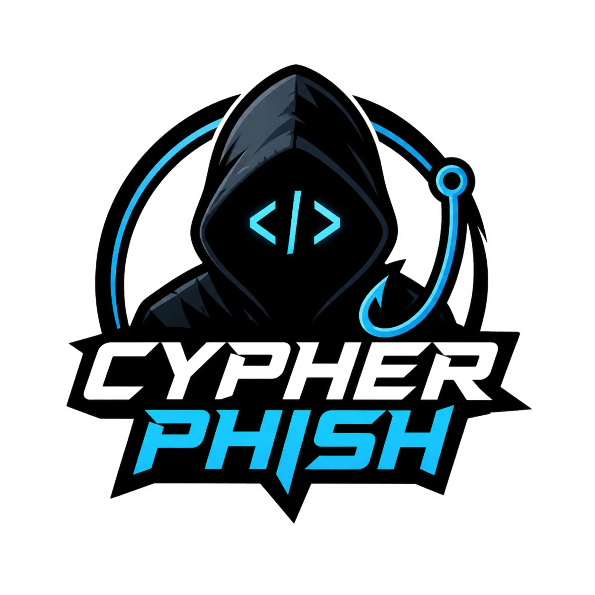

<div align="center">



# Cypher Phish v3.4.0

<p align="center">
  
  
  
  
</p>

<p align="center">
  
  
  
</p>

###  Automated phishing tool with 30+ templates
</div>

<h3 align="center">Disclaimer</h3>


Any actions and/or activities related to **Cypher Phish** are solely your responsibility.  
The misuse of this toolkit may result in criminal charges against the individuals involved.  
The developer and contributors will not be held responsible for any misuse or illegal activities performed using this project.

This toolkit contains materials that may be considered dangerous or harmful if used improperly.  
Users are responsible for understanding and complying with the laws and regulations of their country before accessing or using this software.

This project is created strictly for educational purposes, security research, and authorized testing environments only.  
Do not use this toolkit for illegal access, credential theft, privacy violations, or malicious activities.

Unauthorized phishing attacks against real targets are illegal and unethical.

Use responsibly and at your own risk.

---

# ✨ Features

- Latest login page templates
- Modern terminal UI
- Cloudflared tunnel integration
- Telegram bot notifications
- Auto dependency installer
- URL masking support
- Auto redirect after capture
- Localhost hosting support
- Public URL generation
- Real-time credential logging
- Real-time IP capture
- Saved Telegram configuration
- Architecture auto-detection
- Termux optimized
- Lightweight & fast
- 35+ website templates

---

# 🌐 Tunneling Options

- Localhost
- Cloudflared Tunnel

---

# 📂 Installation

## Linux / Termux

```bash
git clone --depth=1 https://github.com/HYDRA-TERMUX/Cypher-Phish.git

cd Cypher-Phish

chmod +x *

bash cypher-phish.sh
```

---

# 📱 Installation (Termux)

```bash
pkg update -y && pkg upgrade -y

pkg install git -y

git clone https://github.com/HYDRA-TERMUX/Cypher-Phish

cd Cypher-Phish

chmod +x *

bash cypher-phish.sh
```

---

# ⚡ First Launch

On first startup, Cypher Phish automatically installs all required dependencies.

Required packages:

- php
- curl
- unzip
- cloudflared
- proot
- ncurses-utils

---

# 🚀 Usage

```bash
bash cypher-phish.sh
```

---

# 🎭 Available Templates

| Social Media | Services | Gaming | Developer |
|--------------|-----------|---------|------------|
| Facebook | Google | Steam | Github |
| Instagram | Microsoft | Playstation | Gitlab |
| Twitter | Netflix | Xbox | StackOverflow |
| TikTok | Paypal | Twitch | Discord |
| Reddit | Dropbox | Roblox | Adobe |

And many more...

---

# 📡 Telegram Bot Notifications

Cypher Phish supports Telegram integration for instant credential notifications.

### Setup

1. Open Telegram
2. Search `@BotFather`
3. Create a new bot using `/newbot`
4. Copy the bot token
5. Start a chat with your bot
6. Send a message to the bot
7. Launch Cypher Phish and enable Telegram setup

---

# 🔗 URL Masking

Cypher Phish supports `@-Trick` URL masking.

### Example

```text
https://facebook.com@random.trycloudflare.com
```

---

# 🛠 Dependencies

Cypher Phish requires the following programs:

- `git`
- `curl`
- `php`
- `unzip`

All dependencies are installed automatically on first launch.

---

# 📸 Workflow

<p align="center">
  
</p>

---

# 👨‍💻 Developer

<p align="left">
  <a href="https://github.com/HYDRA-TERMUX" target="_blank">
    
  </a>
</p>

---

# ❤️ Support

If you like this project:

⭐ Star the repository  
🍴 Fork the project  
📢 Share with others  

---

# 📜 License

This project is intended for educational and authorized security research purposes only.

Unauthorized phishing attacks are illegal.

Use responsibly.

---

<p align="center">
  
</p>


- **HTR-TECH** - For [ZPhisher](https://github.com/htr-tech/zphisher)


# ⭐ Support

If you found this project useful:

* ⭐ Star the repository
* 🐛 Report issues
* 🔔 Follow for updates
* 🤝 Contribute improvements

---

# ⚖️ Legal Reminder

Always ensure you have:

* Written authorization
* Organizational approval
* Legal permission
* Ethical justification

before conducting any phishing simulation or security assessment.

Unauthorized use may violate cybersecurity laws in your country.
